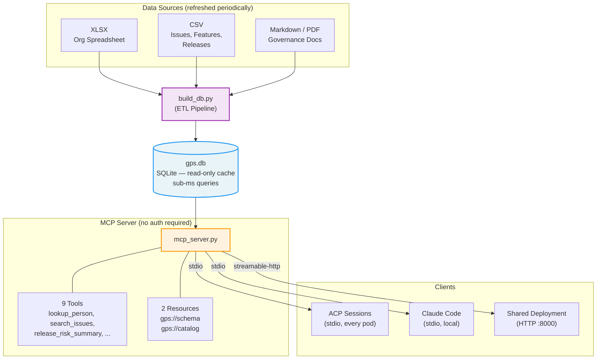
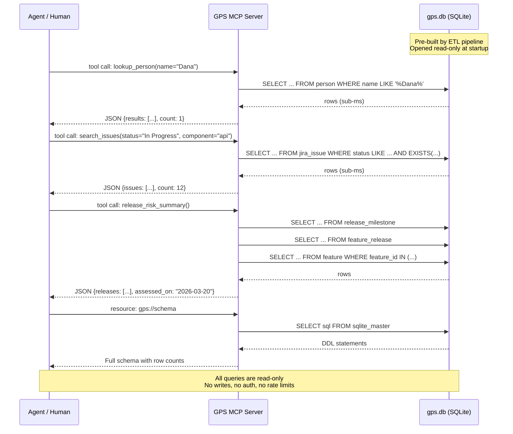

# GPS - Global Positioning System MCP Server

A read-only caching tier that gives agents and humans sub-millisecond access to org and engineering data. GPS materializes people, teams, issues, features, release schedules, component mappings, and governance documents into a SQLite database and serves them over [MCP](https://modelcontextprotocol.io) — optimized for high-frequency agent queries with zero upstream latency.

**Why GPS exists:** Agents need fast, reliable access to org and engineering data. Querying live APIs (Jira, Confluence, HR systems) on every turn is slow, rate-limited, and fragile. GPS pre-materializes everything into a single SQLite file, opens it read-only, and serves structured results in microseconds. No auth, no rate limits, no network dependencies at query time.

## 5-Minute Quickstart

```bash
# 1. Clone and enter
git clone https://github.com/YOUR-ORG/gps.git && cd gps

# 2. Install uv (if needed)
curl -LsSf https://astral.sh/uv/install.sh | sh

# 3. Copy env and customize org mapping
cp .env.example .env

# 4. Place your data files in data/
#    - An XLSX org spreadsheet (any .xlsx file)
#    - CSV exports: issues, features, releases, etc.
#    (Example data ships in data/acme-* for testing)

# 5. Build the database
uv run scripts/build_db.py --force

# 6. Run tests
scripts/test.sh

# 7. Start the MCP server
uv run mcp_server.py              # stdio (for Claude Code / ACP)
uv run mcp_server.py --http       # HTTP on :8000 (for shared deployments)
```

## Architecture



### How it works

1. **ETL pipeline** (`scripts/build_db.py`) loads all sources into a single SQLite database — runs periodically, not per-query
2. **MCP server** (`mcp_server.py`) opens the database read-only with mmap, 64MB cache, and memory-backed temp store — tuned for agent query patterns
3. **No auth required** — the database contains read-only organizational data; agents connect directly via stdio or HTTP
4. The LLM never touches upstream data sources directly — clean security boundary

### Client-Server Interaction



## MCP Tools

| Tool | Description |
|------|-------------|
| `lookup_person` | Find people by name, email, or user ID (partial match) |
| `list_team_members` | List all members of a scrum team with roles and components |
| `search_issues` | Search issues by status, priority, assignee, component, label, or keyword |
| `get_feature_status` | Get feature details: progress, RICE score, releases, components, teams |
| `release_risk_summary` | Assess release risk — flags features under 80% complete near milestones |
| `list_documents` | List governance documents with table of contents |
| `get_document` | Retrieve full governance document content by ID |
| `get_document_section` | Retrieve a specific section by fuzzy heading match |
| `get_gps_version` | Return GPS version and build metadata |

## MCP Resources

| URI | Description |
|-----|-------------|
| `gps://schema` | Full database DDL with row counts — agents should read this first |
| `gps://catalog` | Data source inventory (DATA_CATALOG.yaml) |

## Wiring GPS into ACP Sessions

GPS runs as a sidecar MCP in every ACP pod — no auth needed. The recommended approach is adding it to the runner's managed settings:

```json
{
  "mcpServers": {
    "gps": {
      "command": "uv",
      "args": ["run", "--script", "/app/gps/mcp_server.py"]
    }
  }
}
```

Bake `mcp_server.py` + `data/gps.db` + `VERSION` into the runner image or mount via shared volume. For init container and HTTP sidecar patterns, see [docs/DEPLOYMENT.md](docs/DEPLOYMENT.md).

## Project Structure

```
mcp_server.py          MCP server (stdio default, --http for HTTP)
scripts/
  build_db.py          ETL pipeline — materializes gps.db from source files
  test.sh              Test suite (lint, build, integrity, schema diff)
data/
  acme-*               Example data files (tracked)
  *.csv, *.xlsx, *.db  User data files (gitignored)
deploy/
  deploy.sh            Build, apply, status, logs automation
  k8s/                 Kubernetes/OpenShift manifests (kustomize)
docs/
  adr/                 Architecture Decision Records
  DEPLOYMENT.md        Deployment guide (local, container, k8s, ACP)
  CUSTOMIZATION.md     Customization guide (env vars, adding sources)
  SCHEMA.md            Database schema reference (ER diagram, tables, views)
governance/            Policy documents (auto-loaded into DB)
Containerfile          Container image build
.env.example           Configuration template
.mcp.json              Claude Code MCP server config
```

## Configuration

GPS is configured via environment variables (see `.env.example`):

- `GPS_TAB_ORG_MAP` — JSON mapping of XLSX tab names to `[org_key, org_name]` pairs
- `GPS_JIRA_SCRUM_REF_TAB` — XLSX tab name for Jira-to-Scrum-team mappings

## License

MIT
