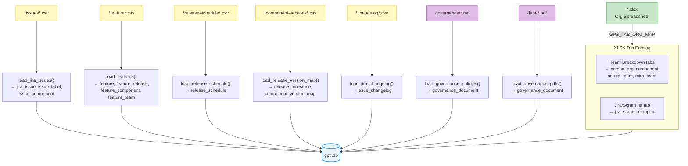

# Customization Guide

GPS is a read-only caching tier for org and engineering data. It's designed to be forked and adapted — point it at your own data sources and every agent in your fleet gets sub-millisecond access to your org structure, issues, features, and releases.

## ETL Data Flow



## Org Spreadsheet Mapping

The ETL pipeline reads team breakdowns from XLSX tabs. Configure which tabs to load via the `GPS_TAB_ORG_MAP` environment variable (JSON):

```bash
# .env
GPS_TAB_ORG_MAP='{"Platform - Team Breakdown": ["platform", "Platform"], "Data Services - Team Breakdown": ["data-services", "Data Services"]}'
```

Each key is an XLSX tab name. Each value is `[org_key, org_name]`:
- `org_key` — short identifier used in queries
- `org_name` — display name

The Jira-to-Scrum-team reference tab is also configurable:

```bash
GPS_JIRA_SCRUM_REF_TAB=Jira and Scrum teams
```

## CSV File Naming

`build_db.py` auto-discovers CSV files by pattern matching against filenames. The default patterns are:

| Pattern | Data Source |
|---------|-------------|
| `acme-issues` | Jira issues export |
| `acme-feature` | Feature planning / RICE scores |
| `acme-release-schedule` | Release schedule |
| `acme-changelog` | Jira issue changelog |
| `acme-component-versions` | Release-to-component version mapping |

To use different patterns, update the `csv_sources` list in `build_db.py`.

## XLSX Auto-Detection

`build_db.py` picks the newest `.xlsx` file in `data/`. To use a specific file:

```bash
uv run scripts/build_db.py --xlsx data/my-org.xlsx
```

## Adding Data Sources

See [CONTRIBUTING.md](../CONTRIBUTING.md#adding-a-data-source) for the step-by-step guide.

## Governance Documents

Place markdown files in `governance/` — they are loaded as policy documents automatically.

Place PDFs in `data/` — they are extracted via [docling](https://github.com/DS4SD/docling) and loaded as reference documents. Install the optional dependency:

```bash
uv pip install "gps[pdf]"
```

## Database Path

By default the database is `data/gps.db`. Override with:

```bash
uv run scripts/build_db.py --db /path/to/custom.db
```

## MCP Server

The MCP server binds to all interfaces (`0.0.0.0`) in HTTP mode. Allowed hosts for DNS rebinding protection are defined in `ALLOWED_HTTP_HOSTS` in `mcp_server.py`. Add your service hostnames there if deploying behind a proxy.
