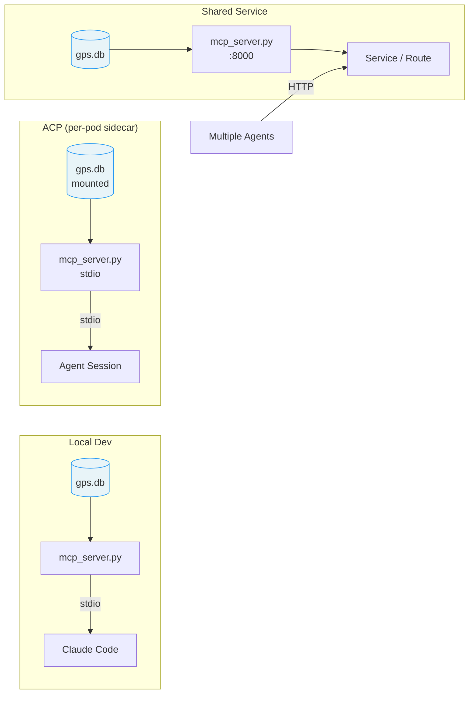

# Deployment Guide

GPS is a read-only caching tier for org and engineering data. It requires no authentication — agents and humans connect directly. Choose a deployment model based on how many sessions need access.

## Deployment Options



## Local Development

```bash
# stdio transport (for Claude Code)
uv run mcp_server.py

# HTTP transport (for LLM frontends)
uv run mcp_server.py --http --port 8000
```

## Wiring GPS into ACP Sessions

GPS is designed to give every ACP session instant access to org and engineering data. No auth needed — the database is read-only. Three patterns:

### Pattern 1: Managed settings (fleet-wide, recommended)

Add GPS to the ACP runner's managed settings so every session gets it automatically:

```json
{
  "mcpServers": {
    "gps": {
      "command": "uv",
      "args": ["run", "--script", "/app/gps/mcp_server.py"]
    }
  }
}
```

Bake `mcp_server.py`, `VERSION`, and `data/gps.db` into the runner image, or mount from a shared PVC.

### Pattern 2: Init container + shared volume

Use an init container to copy the pre-built database into a shared volume:

```yaml
initContainers:
  - name: gps-data
    image: your-registry/gps:latest
    command: ["cp", "/app/data/gps.db", "/shared/gps.db"]
    volumeMounts:
      - name: gps-data
        mountPath: /shared
containers:
  - name: acp-runner
    volumeMounts:
      - name: gps-data
        mountPath: /app/gps/data
        readOnly: true
volumes:
  - name: gps-data
    emptyDir: {}
```

### Pattern 3: HTTP sidecar (shared across pods)

Deploy GPS as a Kubernetes Service. Sessions connect via HTTP — useful when many pods share one database:

```yaml
# In the GPS namespace
apiVersion: v1
kind: Service
metadata:
  name: gps-mcp
spec:
  selector:
    app: mcp-server
  ports:
    - port: 8000
      targetPort: 8000
```

Point sessions at it:

```json
{
  "mcpServers": {
    "gps": {
      "type": "streamable-http",
      "url": "http://gps-mcp.gps.svc:8000/mcp"
    }
  }
}
```

### Refreshing data in ACP

The database is a point-in-time snapshot. To refresh:

1. Run `build_db.py` on a schedule (CronJob or CI pipeline)
2. Rebuild the container image with the new `gps.db`
3. Roll out new pods — sessions pick up the fresh data on next start

Since the database is read-only and file-based, there is no downtime during refresh — old pods serve the old snapshot until replaced.

## Container

Build and run:

```bash
# Build the database first
uv run scripts/build_db.py --force

# Build container image
docker build -f Containerfile -t gps .

# Run
docker run -p 8000:8000 gps
```

The container exposes HTTP transport on port 8000 with a health check at `/health`.

## Kubernetes / OpenShift

Manifests live in `deploy/k8s/` with kustomize overlays.

### Prerequisites

- `kubectl` or `oc` CLI authenticated to your cluster
- A built `gps.db` database
- Container image pushed to a registry

### Deploy

```bash
# Build, test, and apply
deploy/deploy.sh build
deploy/deploy.sh apply

# Check status
deploy/deploy.sh status

# View logs
deploy/deploy.sh logs
```

### Overlays

- `base` — vanilla Kubernetes (default)
- `openshift` — adds Route with TLS edge termination

Select with `--overlay`:

```bash
deploy/deploy.sh apply --overlay openshift
```

### Environment

Set `NAMESPACE` to deploy to a specific namespace:

```bash
NAMESPACE=my-gps deploy/deploy.sh apply
```

## MCP Client Configuration

### Claude Code (stdio)

The `.mcp.json` in the repo root handles this automatically. Or add manually:

```json
{
  "mcpServers": {
    "gps": {
      "command": "uv",
      "args": ["run", "--script", "mcp_server.py"]
    }
  }
}
```

### HTTP clients

Point the MCP client at `http://HOST:8000/mcp` using `streamable-http` transport.

## CI/CD: Release & Deploy Workflow

The `deploy.yml` workflow (manual dispatch only) handles the full release pipeline:

1. **Release** — bumps version, creates git tag, generates changelog, publishes GitHub Release
2. **Build** — builds multi-arch container images (amd64 + arm64), pushes to Quay.io
3. **Merge manifests** — creates multi-arch manifest at `quay.io/ambient_code/gps:<tag>`
4. **Deploy** — applies kustomize manifests to OpenShift, waits for rollout

### Required GitHub Secrets

| Secret | Purpose |
|--------|---------|
| `QUAY_USERNAME` | Quay.io push/pull access |
| `QUAY_PASSWORD` | Quay.io push/pull access |
| `GPS_OPENSHIFT_SERVER` | OCP cluster API URL |
| `GPS_OPENSHIFT_TOKEN` | OCP service account token |

### First Deploy

```bash
# Ensure secrets are configured, then:
gh workflow run deploy.yml -f bump_type=minor
gh run watch
oc get pods -n gps
```

The workflow automatically creates a `quay-pull-secret` in the `gps` namespace from the Quay credentials.

## Security Notes

- The database is opened read-only (`?mode=ro`, `PRAGMA query_only = ON`)
- No authentication required — GPS serves organizational data, not secrets
- HTTP mode includes DNS rebinding protection (localhost, Docker internal only by default)
- No TLS — use a reverse proxy or Route for TLS termination
- Add service hostnames to `ALLOWED_HTTP_HOSTS` in `mcp_server.py` if deploying behind a proxy
