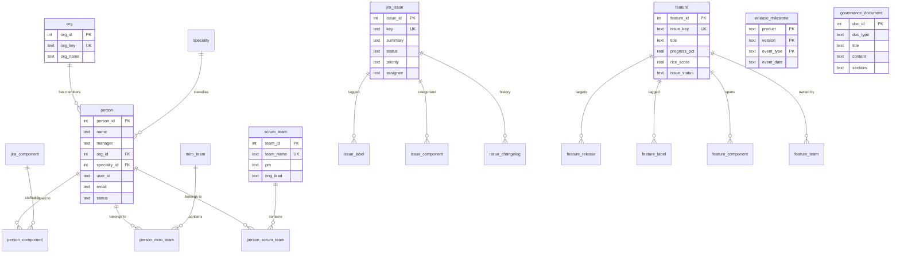

# Database Schema Reference

GPS builds a single SQLite database (`gps.db`) with the following tables, views, and indexes.

## Entity Relationship Diagram



## Tables

### Metadata

| Table | Description |
|-------|-------------|
| `_meta` | Key-value store for build metadata (source hashes, version, timestamps) |

### Org Structure

| Table | Description |
|-------|-------------|
| `org` | Organizations (mapped from XLSX tabs) |
| `person` | People with manager, status, source |
| `jira_component` | Jira components |
| `scrum_team` | Scrum teams with PM and eng lead |
| `miro_team` | Miro board teams |
| `specialty` | Engineering specialties |
| `person_component` | Person-to-component assignments with FTE fraction |
| `person_miro_team` | Person-to-Miro-team assignments |
| `person_scrum_team` | Person-to-Scrum-team assignments |
| `jira_scrum_mapping` | Component-to-Scrum-team reference mapping |

### Jira Issues

| Table | Description |
|-------|-------------|
| `jira_issue` | Issues with key, summary, status, priority, assignee, dates |
| `issue_label` | Issue-to-label associations |
| `issue_component` | Issue-to-component associations |
| `issue_changelog` | Field change history (status transitions, reassignments, etc.) |

### Feature Planning

| Table | Description |
|-------|-------------|
| `feature` | Features with RICE scores, progress, approvals, milestones |
| `feature_release` | Feature-to-release associations |
| `feature_label` | Feature-to-label associations |
| `feature_component` | Feature-to-component associations |
| `feature_team` | Feature-to-team associations |

### Release Management

| Table | Description |
|-------|-------------|
| `release_schedule` | Release tasks with start/finish dates |
| `release_milestone` | Product version milestones (code freeze, release dates) |
| `component_version_map` | Component versions per release |

### Other

| Table | Description |
|-------|-------------|
| `org_chart_raw` | Raw org chart lines (hierarchical text) |
| `governance_document` | Governance docs (policies, references) with sections as JSON |

## Views

| View | Description |
|------|-------------|
| `v_person_detail` | Person with org, specialty, components, teams (denormalized) |
| `v_component_headcount` | Component headcount and FTE totals |
| `v_team_headcount` | Scrum team headcount |
| `v_unassigned` | People not yet assigned to teams |
| `v_issue_component_summary` | Issue counts per component with done/total |
| `v_feature_summary` | Feature counts by status with average RICE score |
| `v_governance_toc` | Governance document table of contents |

## Indexes

Indexes cover all MCP tool query paths:

- `jira_issue`: status, assignee, priority, updated
- `issue_component`: component_name
- `issue_label`: label
- `person`: name, user_id, email
- `feature`: issue_key
- `feature_release`, `feature_component`, `feature_team`: feature_id
- `issue_changelog`: issue_id, field, changed_at
- `release_milestone`: version
- `governance_document`: doc_type

## Schema Baseline

The schema baseline is stored in `data/schema.sql` and checked by `scripts/test.sh`. After schema changes, update the baseline:

```bash
scripts/test.sh --accept-schema
```
