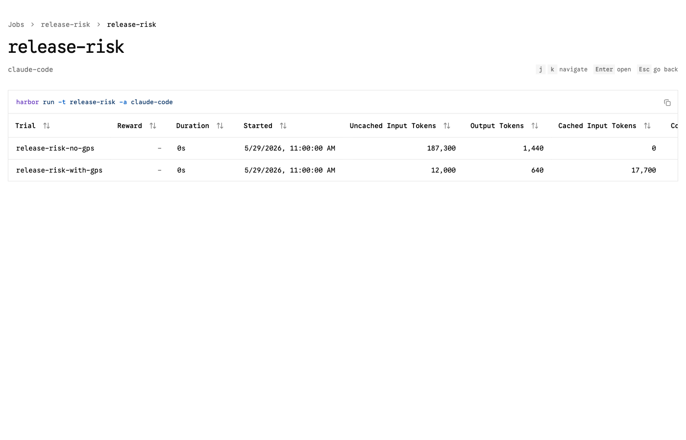
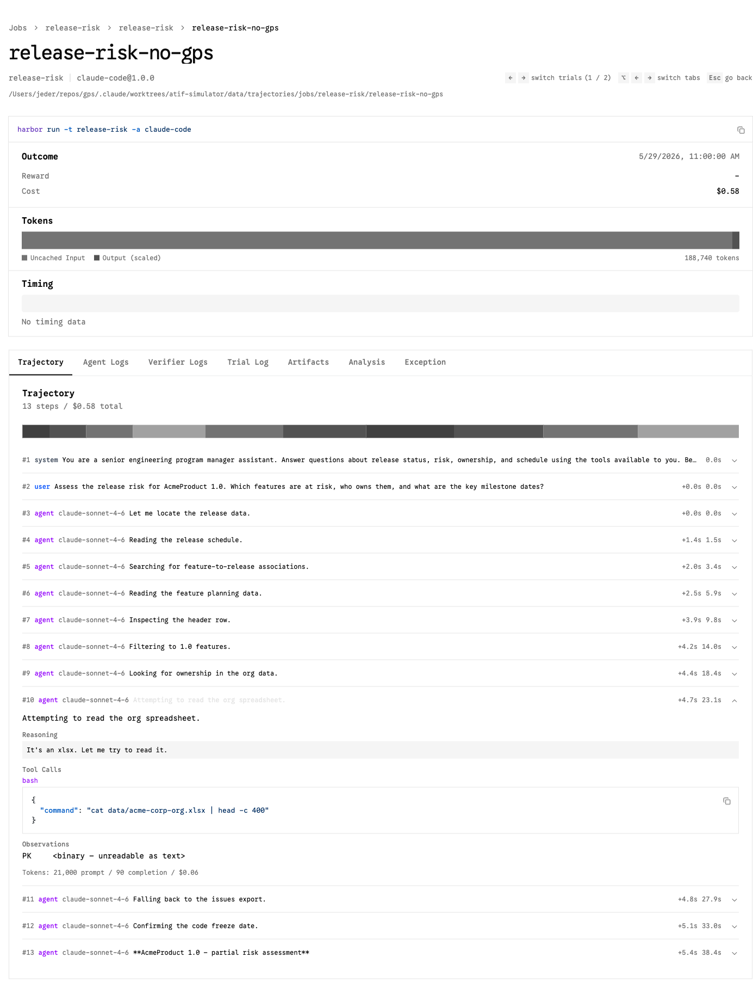

# GPS Impact — Results & Technical Proof

**Scenario:** `release-risk` — *"Assess the release risk for AcmeProduct 1.0. Which
features are at risk, who owns them, and what are the key milestone dates?"*

Two agents, same system prompt, same task, same underlying Acme data. The only
difference is tool access: one has the GPS MCP tools, one does not.

Every figure below is **computed directly from the generated trajectory files** by
`scripts/compare_trajectories.py` — no hand-entered numbers. Reproduce with:

```bash
uv run scripts/simulate_trajectories.py --scenario release-risk --release 1.0
uv run scripts/compare_trajectories.py --scenario release-risk
```

---

## GPS impact — `release-risk`

Computed from `release-risk-no-gps` vs `release-risk-with-gps` trajectory files.

| Metric | Without GPS | With GPS | Reduction | Ratio |
|---|--:|--:|--:|--:|
| Steps | 13 | 7 | −46.2% | 1.9× |
| Prompt tokens | 187,300 | 29,700 | −84.1% | 6.3× |
| Completion tokens | 1,440 | 640 | −55.6% | 2.2× |
| Cost (USD) | $0.5835 | $0.0509 | −91.3% | 11.5× |

**Prompt caching:** 0 cached tokens without GPS vs 17,700 with GPS (structured tool
results are cache-friendly; raw file dumps are not).

### Tool usage (how the work got done)

- **Without GPS:** `bash` ×10 — `find`, `cat`, `grep` against CSVs and a binary xlsx
- **With GPS:** `release_risk_summary` ×1, `get_release_schedule` ×1,
  `get_feature_status` ×1, `lookup_person` ×1

### Outcome

**Without GPS** (partial — could not resolve ownership or RICE):

> **AcmeProduct 1.0 — partial risk assessment**
>
> - **At risk:** ACME-101 (Color Status = 'At Risk').
> - **Key dates:** Code Freeze 2026-04-16, GA 2026-05-15.
> - **Ownership:** likely Platform Squad; Carlos Mendoza appears on auth issues but I
>   could not confirm the feature owner (the org spreadsheet is xlsx and unreadable here).
> - **Gaps:** RICE score and exact % complete were hard to extract from the 41-column
>   planning CSV; treat with caution.

**With GPS** (complete — owner, RICE, completion, and a clear read):

> **AcmeProduct 1.0 — release risk assessment**
>
> - **At risk:** ACME-101 Unified Authentication System — 45% complete, flagged
>   'At Risk' (RICE 88).
> - **Owner:** Carlos Mendoza (Platform Squad).
> - **Key dates:** Code Freeze 2026-04-16 (already passed), GA 2026-05-15.
> - **Read:** with code freeze passed and the feature at 45%, ACME-101 is the primary
>   threat to the 1.0 GA. The other 3 features targeting 1.0 are On Track.

---

## Talking points (each backed by the data above)

1. **~11× cheaper.** $0.58 → $0.05 per task. GPS replaces large raw-file context with
   compact structured results.
2. **~6× fewer prompt tokens.** 187,300 → 29,700. The no-GPS agent pays to drag whole
   files through context on every turn; GPS returns only what was asked.
3. **Half the steps.** 13 → 7. Direct lookups (`release_risk_summary`) collapse a
   multi-step scavenger hunt into one call.
4. **Higher-quality answer.** The no-GPS agent *cannot* read the xlsx org data, so it
   hedges on ownership and omits RICE. GPS resolves owner (Carlos Mendoza), team,
   completion %, and RICE (88) deterministically.
5. **Cache-friendly.** Structured tool results enable prompt caching (17,700 cached
   tokens) that raw file dumps do not.

> The headline isn't only "cheaper" — it's "cheaper **and** more correct." Cost and
> quality move together because GPS removes the failure mode (unreadable source files)
> that forced the baseline to guess.

## Visual proof (Harbor viewer)

Both trials side by side — note the token columns (187,300 vs 12,000 uncached input;
0 vs 17,700 cached):



The no-GPS failure mode, captured in the trajectory — step #10 runs
`cat data/acme-corp-org.xlsx` and the observation is unreadable binary (`PK…`), which
is *why* the baseline can't resolve ownership:



## How to verify (technical proof chain)

1. **Valid ATIF.** Both files pass Harbor's own validator:
   `./scripts/validate_trajectories.sh` → `2/2 valid`.
2. **Recognized by Harbor.** Harbor's `JobScanner` discovers the job and both trials;
   `harbor view data/trajectories/jobs` renders them (asserted in
   `tests/test_simulate_trajectories.py`).
3. **Numbers are derived, not asserted.** `compare_trajectories.py` recomputes every
   metric from the trajectory JSON on each run; the table above is its output.
4. **Visual proof.** In the viewer, open each trial → **Trajectory** tab → expand any
   `agent` step to see its Thought / Tool Call / Observation and per-step tokens/cost.
   Use `← / →` to flip between the two trials.

## What this proves — and what it doesn't

**Proves:** Given GPS's structured tools, the modeled task is resolvable in far fewer
steps/tokens/dollars *and* to a higher level of completeness than scavenging raw
files — and the artifacts are valid, viewable ATIF that quantify the gap reproducibly.

**Does not prove:** That a specific live LLM run reproduces these exact figures. These
trajectories are deterministic simulations that encode a defensible model of agent
behavior (the no-GPS failure mode — unreadable xlsx, wide-CSV misparse — is real and
observable). Empirical confirmation comes from the **real-capture path**: run Claude
Code under Harbor with the data-layer MCP server bundled (stdio) vs. not, and compare
the captured trajectories with this same tooling. The simulator and the real path
produce identical output formats, so `compare_trajectories.py` and the Harbor viewer
work unchanged on real runs.
